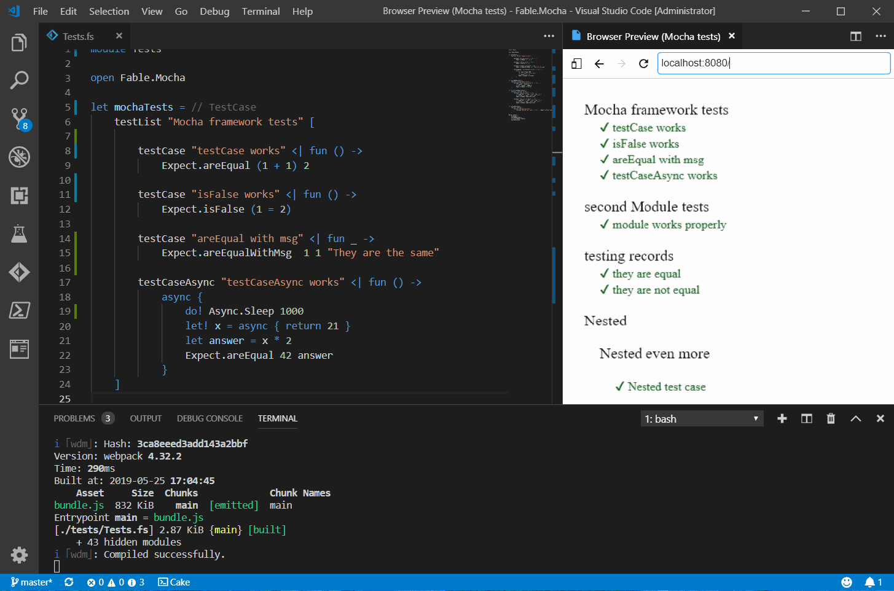

# Fable.Mocha [](https://www.nuget.org/packages/Fable.Mocha) [](https://ci.appveyor.com/project/Zaid-Ajaj/fable-mocha)


[Fable](https://github.com/fable-compiler/Fable) library for testing. Inspired by the popular [Expecto](https://github.com/haf/expecto) library for F# and adopts the `testList`, `testCase` and `testCaseAsync` primitives for defining tests.

The tests themselves are written once and can run:
 - [Inside node.js using Mocha](#running-the-tests-on-nodejs-with-mocha)
 - [Inside the browser](#running-the-tests-using-the-browser) (standalone)
 - [Inside a headless browser](#running-the-tests-using-headless-browser)
 - [Inside dotnet with Expecto](#running-the-tests-on-dotnet-with-Expecto)
 - To Do: Inside dotnet standalone (PR's are welcome)



## Installation
Install the Fable binding from Nuget
```bash
# using nuget
dotnet add package Fable.Mocha

# or with paket
paket add Fable.Mocha --project /path/to/project.fsproj
```

## Writing Tests
Assuming you have you the following project structure:
```
repo
 |
 |-- package.json
 |-- src
      | -- YourLibrary.fsproj
      | -- Library.fs
 |-- tests
      | -- Tests.fsproj
      | -- Tests.fs
```
Where `tests` contains the test project, you will install `Fable.Mocha` into the `Tests.fsproj` and it will look like this:
```xml
<Project Sdk="Microsoft.NET.Sdk">
  <PropertyGroup>
    <TargetFramework>netstandard2.0</TargetFramework>
  </PropertyGroup>
  <ItemGroup>
    <Compile Include="Tests.fs" />
  </ItemGroup>
  <ItemGroup>
    <ProjectReference Include="..\src\YourLibrary.fsproj" />
  </ItemGroup>
  <ItemGroup>
    <PackageReference Include="Fable.Mocha" Version="1.0.0" />
  </ItemGroup>
</Project>
```
then you can start writing your tests into the `Test.fs` file:
```fs
module Tests

open Fable.Mocha

let arithmeticTests =
    testList "Arithmetic tests" [

        testCase "plus works" <| fun () ->
            Expect.equal (1 + 1) 2 "plus"

        testCase "Test for falsehood" <| fun () ->
            Expect.isFalse (1 = 2) "false"

        testCaseAsync "Test async code" <|
            async {
                let! x = async { return 21 }
                let answer = x * 2
                Expect.equal 42 answer "async"
            }
    ]

Mocha.runTests arithmeticTests
```

## Running the tests on node.js with Mocha

Install the actual `mocha` test runner from Npm along side `fable-splitter` that will compile your test project into a node.js application
```bash
npm install --save-dev mocha fable-splitter
```
Add the following `pretest` and `test` npm scripts to your `package.json` file:
```json
"pretest": "fable-splitter tests -o dist/tests --commonjs",
"test": "mocha dist/tests"
```
Now you can simply run `npm test` in your terminal and it will run the `pretest` script to compile the test project and afterwards the `test` script to actually run the (compiled) tests using mocha.

If you don't want to run browser when running tests you should be aware of [possible problems related](https://stackoverflow.com/questions/32236443/mocha-testing-failed-due-to-css-in-webpack) to compilation of css files in Mocha.

To disable compilation of css files you should run following command:
```bash
npm install --save-dev ignore-styles
```

and update `test` npm script in `package.json` file to the following:
```json
"test": "mocha dist/tests --require ignore-styles"
```

## Running the tests using the browser
Trying to use mocha to run tests in the browser will give you headaches as you have to include the compiled individual test files by yourself along with mocha specific dependencies. That's why Fable.Mocha includes a *built-in* test runner for the browser. You don't need to change anything in the existing code, it just works!

Compile your test project using default fable/webpack as follows.

First, install `fable-loader` along with with `webpack` if you haven't already:
```
npm install fable-loader webpack webpack-cli webpack-dev-server
```
Add an `index.html` page inside directory called `public` that contains:
```html
<!DOCTYPE html>
<html>
    <head>
        <title>Mocha tests</title>
    </head>
    <body>
        <script src="bundle.js"></script>
    </body>
</html>
```
Create a webpack config file that compiles your `Tests.fsproj`
```js
var path = require("path");

module.exports = {
    entry: "./tests/Tests.fsproj",
    output: {
        path: path.join(__dirname, "./public"),
        filename: "bundle.js",
    },
    devServer: {
        contentBase: "./public",
        port: 8080,
    },
    module: {
        rules: [{
            test: /\.fs(x|proj)?$/,
            use: "fable-loader"
        }]
    }
}
```

Now you can run your tests live using webpack-dev-server or compile the tests and run them by yourself. Add these scripts to your `package.json`
```
"start": "webpack-dev-server",
"build-for-browser": "webpack"
```
Now if you run `npm start` you can navigate to `http://localhost:8080` to see the results of your tests.

## Running the tests using headless browser

The tests you write in the browser can be easily executed inside a headless browser such you can run them in your CI server. Using a simple console application, install the package `Fable.MochaPuppeteerRunner`:
```
mkdir HeadlessTests
cd HeadlessTests
dotnet new console -lang F#
dotnet add package Fable.MochaPuppeteerRunner
```
Then change the contents of `Program.fs` into:
```fsharp
[<EntryPoint>]
let main argv =
    "../public"
    |> System.IO.Path.GetFullPath
    |> Puppeteer.runTests
    |> Async.RunSynchronously
```
Where `public` is the directory where the compiled tests, the `bundle.js` file next to `index.html`:
```
{repo}
   |
   |-- HeadlessTests
        |-- HeadlessTests.fsproj
        |-- Program.fs

   |-- public
        |-- index.html
        |-- bundle.js
```
Also you need to add the `RunWorkingDirectory` property to `HeadlessTests.fsproj` as follows below:
```xml
<PropertyGroup>
  <OutputType>Exe</OutputType>
  <TargetFramework>netcoreapp3.0</TargetFramework>
  <RunWorkingDirectory>$(MSBuildProjectDirectory)</RunWorkingDirectory>
</PropertyGroup>
```
Now simply `dotnet run` and the tests will run inside the headless browser after the download finishes.

You can also add a npm build script to run the headless tests after compiling the `Tests` project:
```
"test-headless": "webpack && dotnet run --project ./HeadlessTests/HeadlessTests.fsproj"
```

Remember to gitignore the directory of the downloaded chromium add `.local-chromium` to your gitignore file.

## Running the tests on dotnet with Expecto

Since the API exactly follows that of Expecto's you can simply run the tests on dotnet as well using Expecto. This way you can check whether your code runs correctly on different platforms whether it is dotnet or node.js. This is achieved using *compiler directives* as follows. First of all you need to install the `Expecto` library from nuget:
```
dotnet add package Expecto
```
Then inside your `Test.fs` file, you can the use the special `FABLE_COMPILER` directive. This directive is active when Fable is compiling the project, if it is not active it means that the project being compiled using dotnet like any other dotnet application.

When Fable is compiling the project, you hide the dotnet specific code (i.e. using Expecto) and when dotnet is compiling the code, you hide the Fable specific code (i.e. using Fable.Mocha).
```fs
#if FABLE_COMPILER
open Fable.Mocha
#else
open Expecto
#endif
```
The same goes for the entry point:
```fs
[<EntryPoint>]
let main args =
#if FABLE_COMPILER
    Mocha.runTests allTests
#else
    runTestsWithArgs defaultConfig args allTests
#endif
```
And you are done, the code of the tests themselves doesn't need to change! Of course assuming you don't have platform specific code in there. This feature is made to test pure F# code that should give the same results with dotnet and Fable.

### Testing multiple modules
The function `Mocha.runTests` can take *nested* test lists so you can group multiple test lists under a larger `testList "All"` that combines all the tests
```fs
module Tests

open Fable.Mocha

let firstModuleTests =
    testList "firstModule" [
        testCase "module works properly" <| fun _ ->
            let answer = 21
            Expect.areEqual 42 (answer * 2)
    ]

let secondModuleTests =
    testList "secondModuleModule" [
        testCase "module works properly" <| fun _ ->
            let answer = 31415.0
            let pi = answer / 10000.0
            Expect.areEqual 3.1415 pi
    ]

// Tests can be nested too!
let nestedTests =
    testList "first level" [
        testList "second level" [
            testCase "my test code" <| fun _ -> ()
        ]
    ]

let allTests = testList "All" [
    firstModuleTests
    secondModuleTests
    nestedTests
]

Mocha.runTests allTests
```
### Sequential Tests
To run tests in succession in the browser, you can use `testSequenced` as follows:
```fs
testSequenced <| testList "Sequential" [
    testCaseAsync "one" <| async {
        do! Async.Sleep 1000
    }

    testCase "sync one" <| fun _ -> Expect.isTrue true ""

    testCaseAsync "two" <| async {
        do! Async.Sleep 1000
    }

    testCase "sync two" <| fun _ -> Expect.isTrue true ""

    testCaseAsync "three" <| async {
        do! Async.Sleep 1000
    }
]
```
The browser runner will make sure these tests are run in succession, one after another. The mocha runner in node.js runs the tests sequentially by default.